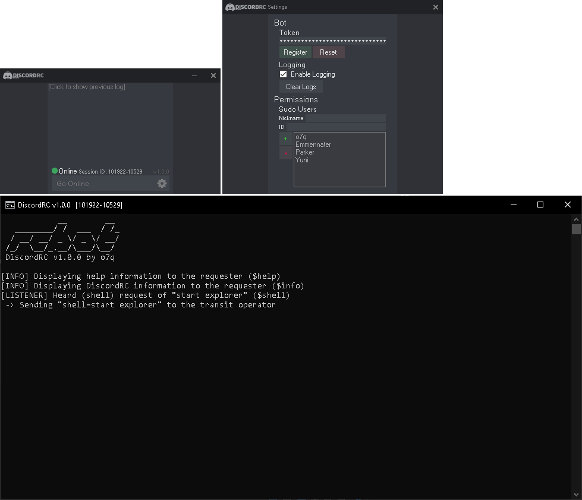

# [<b>>> Download Latest</b>](https://github.com/o7q/DiscordRC/releases/download/v1.0.0/DiscordRC.v1.0.0.7z)
<h3>Welcome! DiscordRC is a simple tool that allows you to remotely control Windows-based systems with a Discord bot on any platform.

It requires no prior installation other than configuring a Discord bot.</h3>

---

---

# Overview
DiscordRC is a gui-based remote connection tool used for controlling Windows based operating systems through shell inputs. This would be most helpful in server based scenarios, which in my case it is what I am making this tool for. \
<i>* This is not a remote desktop tool.</i>

### Powered by:
Node.js: https://nodejs.org \
discord.js: https://discord.js.org

---

# Usage

## <b>Commands</b>
<b>$help</b> Displays the DiscordRC help page \
<b>$shell</b> Executes a shell script \
<b>$rc_shutdown</b> Shuts down DiscordRC \
<b>$info</b> Displays info about DiscordRC

## <b>Components</b>
<b>Log Textbox</b> Displays the previous log after DiscordRC shuts down. Clicking will toggle the viewer on and off. \
<b>Go Online</b> Starts the DiscordRC `rcbot` and starts listening in all servers it is present in \
<b>Settings Cog</b> Opens the settings window

## <b>Settings</b>
<b>Bot Token</b> Manage your Discord bot token
* Register (stores the token information to the config)
* Reset (deletes the token information from the config)

<b>Logging</b> Configure the logging options
* Clear Logs (deletes all logs with the `.log` keyword in it)

<b>Sudo Users</b> Configure who and who cannot use DiscordRC
* The `Nickname` can be whatever you want, it just allows you to keep track of who has perms
* The `ID` refers to the users `Discord ID`

---

<b>DiscordRC</b> \
<i>Programmed with C# and .NET Framework 4.8</i> \
<i>* If you want to compile the code yourself I highly recommend using Visual Studio</i>

<b>rcbot</b> \
<i>Progammed with JavaScript, Node.js, and discord.js</i>

<b>transit_operator & transit_dummy</b> \
<i>Programmed with C++ and compiled using MinGW G++</i>